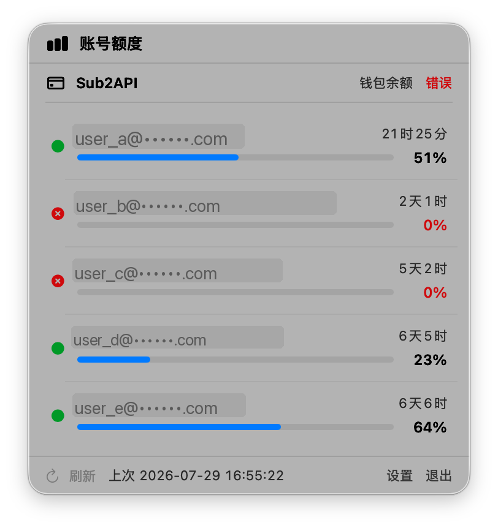
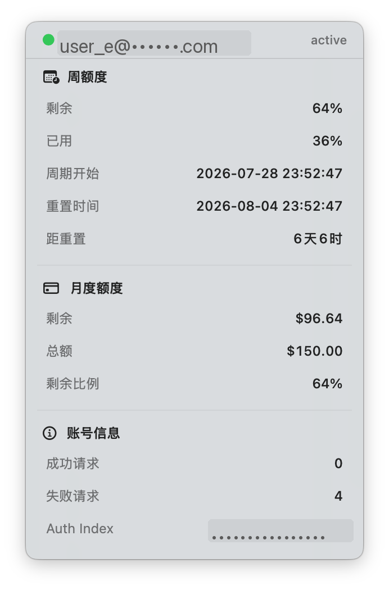
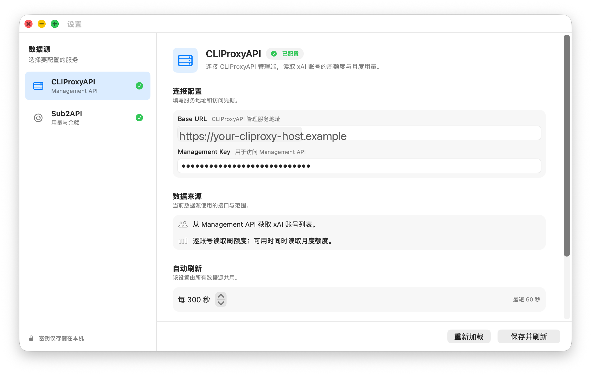

# AIstat

macOS 菜单栏工具，用来查看 AI 订阅账号的额度使用情况。

点击菜单栏图标即可展开面板，同时查看多个账号的周额度剩余、重置时间与状态；悬停账号可看更详细的周/月额度信息。数据源支持 [CLIProxyAPI](https://github.com/router-for-me/CLIProxyAPI)、Sub2API 与 DeepSeek 官方余额。

## 截图







## 功能

- 菜单栏摘要：显示最紧账号的剩余百分比，例如 `额度 34%`
- **多组 CLIProxyAPI / Sub2API / DeepSeek 连接**：每组可单独命名；菜单栏按 CLIProxy 名称分组，Sub2 / DeepSeek 余额前缀连接名
- 多订阅账号列表：状态点、周额度进度条（以剩余为主）、重置倒计时
- 悬停详情：周额度、月度额度、账号状态
- **桌面小组件（WidgetKit）**：Small / Medium / Large 列表样式，外加大号「额度仪表盘」环形图；**每个实例单独编辑选择展示账号（CLIProxy 多选，余额账号 Sub2 / DeepSeek 单选）**
- 自动刷新（默认 5 分钟，最短 1 分钟）；手动刷新最短间隔 1 分钟
- 可选：优先消耗即将刷新额度的账号（默认关闭；**按每个 CLIProxy 连接独立配置**）
- 可选：开机自动启动（系统登录项，默认关闭）
- 并发拉取账号数据，单连接 / 单账号失败不影响其他
- 多数据源设置：CLIProxyAPI、Sub2API（统一「添加账号」弹窗，左侧每连接独立标签）

## 系统要求

- macOS 14+（小组件实例配置依赖 App Intents）
- Apple Silicon（arm64）
- Swift 5.9+（Xcode 自带 toolchain 即可）

## 安装

### 从 Release 下载

在 [Releases](https://github.com/zkytech/aistat/releases) 下载最新的 `AIstat-macos-arm64.zip`，解压后将 `AIstat.app` 移到 `~/Applications` 并打开。

首次打开若被 Gatekeeper 拦截，可在 Finder 中右键 → 打开。

### 从源码安装

```bash
git clone https://github.com/zkytech/aistat.git
cd aistat
./scripts/install.sh
```

默认安装到 `~/Applications/AIstat.app`。

常用选项：

```bash
./scripts/install.sh --no-launch
./scripts/install.sh --app-path "$HOME/Applications/AIstat.app"
./scripts/install.sh --debug
```

仅打包不安装：

```bash
./scripts/package.sh
# 输出 dist/AIstat.app 与 dist/AIstat-macos-arm64.zip
```

推送到 `main` 后，GitHub Actions 会自动测试、打包，并以 `yyyyMMdd HH:mm:ss`（Asia/Shanghai）为标题发布 Release。

## 配置

首次启动若未配置，可通过面板底部的「设置」填写：

| 数据源 | 需要配置 |
|--------|----------|
| CLIProxyAPI | 可添加多组：名称、Base URL、Management Key |
| Sub2API | 可添加多组：名称、Base URL、API Key |
| DeepSeek | 可添加多组：名称、API Key（使用官方余额接口，无需 Base URL） |

CLIProxyAPI 每组专属选项：

- **优先消耗即将刷新额度的账号**（默认关闭，**按连接独立生效**）：开启后，该连接下菜单列表与写回的 priority 都按周额度重置时间临近程度排序（**周额度已用尽 / 剩余 0%** 的账号固定排最后、priority 最低）。关闭时保持接口返回顺序，且不修改账号 priority。

菜单栏展示：

- 订阅账号按 **CLIProxyAPI 连接名称** 分组
- Sub2API / DeepSeek 余额前缀为 **连接名称**

共享设置：

- 自动刷新间隔（默认 300 秒，最短 60 秒）
- 开机自动启动（默认关闭；使用系统登录项，不写入 `config.json`）

菜单栏始终显示全部已配置连接，无需勾选。

配置保存在本机：

```text
~/Library/Application Support/aistat/config.json
```

示例：

```json
{
  "cliProxyConnections": [
    {
      "id": "…",
      "name": "家里",
      "baseURL": "https://your-cliproxy-host",
      "managementKey": "<management-key>",
      "preferNearRefreshAccounts": false
    }
  ],
  "sub2APIConnections": [
    {
      "id": "…",
      "name": "主账户",
      "baseURL": "https://your-sub2api-host",
      "apiKey": "<api-key>"
    }
  ],
  "deepSeekConnections": [
    {
      "id": "…",
      "name": "DeepSeek",
      "apiKey": "<deepseek-api-key>"
    }
  ],
  "refreshIntervalSeconds": 300
}
```

旧版单连接配置（`baseURL` / `managementKey` 等）首次加载时会自动迁移为名为「默认」的一组连接。

密钥只保存在本机，文件权限会尽量设为 `600`。请勿把真实 key 提交到 git。

## 桌面小组件

1. 在设置中通过 **添加账号** 配置 CLIProxyAPI / Sub2API / DeepSeek 连接，并至少成功刷新一次（主程序写入脱敏快照）。
2. 打开 **通知中心** 或桌面编辑模式 → 添加 **AIstat** / **账号额度** / **额度仪表盘**。
3. **编辑该小组件实例**，在配置里选择要展示的 CLIProxyAPI 账号（多选）与余额账号（Sub2 / DeepSeek 单选；每个实例独立；未选择时显示空状态）。
4. 可选样式：
   - **账号额度 · Small**：最紧账号的大号剩余百分比 + 进度条 + 重置倒计时
   - **账号额度 · Medium**：最多 3 个账号行 + Sub2 余额条
   - **账号额度 · Large**：进度条列表（最多 5 个账号）
   - **额度仪表盘 · Large**：电量式环形图网格（最多 6 个账号，≤4 用 2 列，否则 3 列）

小组件只读取脱敏后的额度快照（不含 management key）。主程序会把快照写到小组件沙盒目录，供 Widget 读取。

### 添加步骤

1. 启动 AIstat，打开菜单栏面板触发一次刷新  
2. 桌面右键 → **编辑小组件**（或通知中心底部「编辑小组件」）  
3. 搜索 **AIstat** / **额度** / **账号额度** / **额度仪表盘**  
4. 添加列表样式（Small / Medium / Large）或仪表盘（Large）

若仍看不到：在终端执行 `killall chronod`，再重新打开编辑小组件界面。

## Herdr 插件

仓库内 `herdr-plugin/` 提供 **Herdr** 终端插件，在 TUI 中查看与菜单栏主面板对齐的额度 / 余额（读同一份 `config.json`）。

```bash
herdr plugin link /path/to/aistat/herdr-plugin
herdr plugin pane open --plugin aistat.quota --entrypoint main
```

详见 [herdr-plugin/README.md](herdr-plugin/README.md)。

## 开发

```bash
swift build
swift run aistat
swift test
```

## License

MIT
